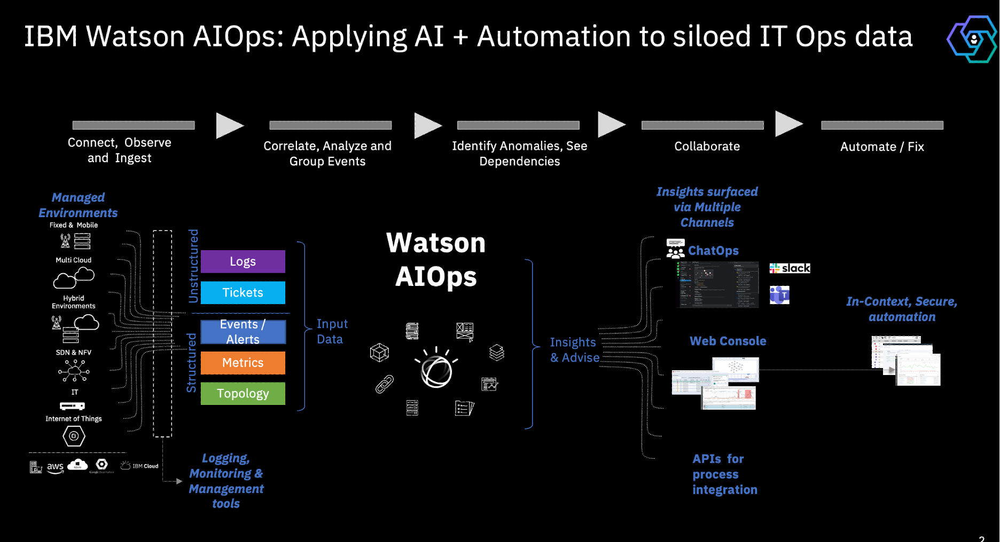

# Proactive Incident Resoultion with IBM Cloud Pak for Watson AIOps and IBM SevOne 

This document describes the Proactive Incident Resoultion with IBM Cloud Pak for Watson AIOps and IBM SevOne demo.

Welcome

Welcome to the demonstration of the Proactive Incident Resoultion with IBM Cloud Pak for Watson AIOps and IBM SevOne.

## WAIOps Introduction

IBM Cloud Pak for Watson AIOps is an AIOps solution that deploys advanced, AI across the ITOps toolchain to confidently assess, diagnose and resolve incidents across mission-critical workloads quickly.

Cloud Pak for Watson AIOps reduces the time spent detecting and identifying incidents, potentially helping teams to fix an outage before a customer submits a ticket.

## How WAIOps Works

How does the Watson AIOps works. It connects to the various logging, monitoring and management tools pointing  to the various environment and collect the structured and unstructured data from Logs, Events, metrics, topology and tickets information from them.  
It correlates, analyze and group events. It Identify Anomalies, see the dependencies and Collabrate via chatops and web-console. It also associate the runbooks to the events and allows to execute the runbook automatically or by SRE to resolve the problem.

## SevOne and WAIOps Integration Architecture

IBM SevOne is a Network Performance monitoring and management solution.

The events from the SevOne also can be pushed to Watson AIOps solution for correlation and grouping.
 
The SevOne Probe from Watson AIOps helps to create webhook endpoint to receive policy based alerts from SevOne into Watson AIOps. 

## Operational Architecture of the Demo
 

Here is the operational Architecture. Here we are going to use an application called iLender which is a fintech app based on microservices and deployed on Kubernetes/Openshift platform. Watson AIOps AI Manager is installed another Openshift cluster. The application logs are send to Humio and WAIOps pick the logs from Humio for log anomaly processing. The SevOne is installed and monitoring the managed environment that includes the cluster where app is installed. The SevOne Probe is installed to push SevOne events into WAIOps.

## WAIOps console

Here is the WAIOps console.

Application Resource

Here is the iLender application imported into AIMgr as a Resource. This application has 28 resources available. 

 

### Application Topology

Here is the topology of the application
•	This topology shows the list of components available in the application. 
•	It shows various elements of the application starting from the Node, POD, Service and Deployment.
•	This topology is built dynamically and will be updated periodically by WAIOps automatically. 
•	The update frequency is configurable.
•	This topology was observed from the Kubernetes cluster using the Kube-observer of the WAIOPs.

 

### Stories and Alerts

Watson AIOps create incidents as a story and it contains the relevant alerts inside. Here is the stories screen without any stories.

 

 
## SevOne console

Here is the SevOne console, where it shows the Policy Brower. You can notice that there are two policies created for iLender related to the Memory and CPU usage.

 

Here is the details of the Memory Utilization High policy.

 
 
Here is the details of the CPU usage High policy. 

 

When there is an increase in memory or CPU beyond the specified threshold values, then SevOne would create an alert and push it to Webhook  created by the SevOne Probe of WAIOps. The Probe would forward the events to WAIOps.

## Demo

Now lets get into the storyline of the demo. The iLender Application has experience heavy load and after some period of time, there is a story created in Watson AIOps. Here is the story that says Abnormal behaviour in the in the logs of the iLender Creditscore service component. 

### Stories 

 

 
### Alerts

Here is the alerts section showing all the alerts in the Watson AIOps.

 

### Story Details

If we open the story and see the details, it shows the list of probable cause of alerts or events correlated into this story.  It has alerts, topology and several other information related to this story.

   
 
### Alerts in the Story

Here is the alerts section of the story showing the all the alerts correlated as part of this story.

WAIOps nicely correlated all the events related to this issue, by using, the event grouping algorithms.

•	The first event shows that the iLender memory Utilization is high. 
•	This alert we have got from SevOne Probe.
•	The second event is about iLender CPU usage high and it is also from SevOne Probe.
•	There is an alert from the logging system about the Abnormal Behaviour in ilender-creditscore service.

•	WAIOps uses Artificial Intelligence to aggregate all relevant information about the issue into a single story.
•	Instead of forcing us to manually evaluate the information from multiple tools, WAIOps created story by correlating events, logs, metrics and alerts from all the services that were affected by the same underlying issue.

This helps the SRE to see all the interlinked alerts from the dependent services for the same problem as a single pane of glass

Here it Looks like the problem is with the creditscore only.

 

### Topology Blast Radius in the story

The topology sections shows the blast radius of the issue highlighting the issues in the various resources.

 

### Application Resource 

The iLender application sections also shows the details about the issue.

 

### The iLender application topology also shows the issues.

 

## Story Detail and Runbook 

Again, coming back to Story.

•	I could see there is a runbook associated with this event.

•	Watson AIOPs has a comprehensive Runbook management system, which allows you to define runbooks, associate with the events and execute them. 
•	The runbooks can be manual, semi-automatic or fully automatic. 
•	The runbook association to an event happens automatically based on pre-configured rules defined at the time of creating the runbook.
•	You can also configure the option to trigger the runbook automatically if an incident happens.

•	In this case, the runbook is associated with this event based on the preconfigured rules and waiting for manual execution.

•	I want to see the Preview of the Runbook details.

 

## Execute  Runbook 

•	Once I review the runbook details, I start the runbook to execute.

 

 

 

## Resolve Story

•	Once the runbook completes the execution, the problem is resolved, and I mark the story as closed.

 

•	The story goes to resolved status. 

 

•	All the probable cause alerts are also getting cleared.

## Conclusion

To conclude the demo, 
•	WAIOps was able to correlate Events from SevOne, logs from logging system and Topology from Kube Observer and  helps to identify the probable of the cause of the problem proactively and create issues. 
•	Using the WAIOPs, from a single interface, without needing to switch between multiple tools, I was able quickly look at the various information provided by WAIOps to identify the source of the problem and Execute the runbook to resolve the issue.

 

## Data and Tool connections

Here are the various integrations or data and tool connections created for this demo. You can see the Humio for logs, Kube observer for Topology and SSH for the runbook. And there was an SevOne Probe created in the OpenShift cluster where WAIOps was installed. 

 

## Runbook 
Here is the Policy related to runbook.

 

Here is the runbook.

 

Here is the action associated with the runbook.

 

## Log Anomaly AI-Model

Here is the AI Model defined for the log anomaly detection.

 

Here is the AI Model defined for the log anomaly detection in detail.

 
