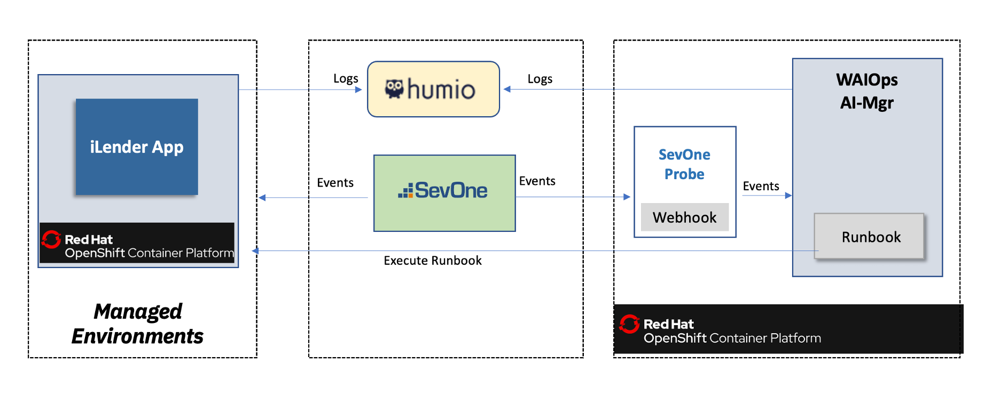
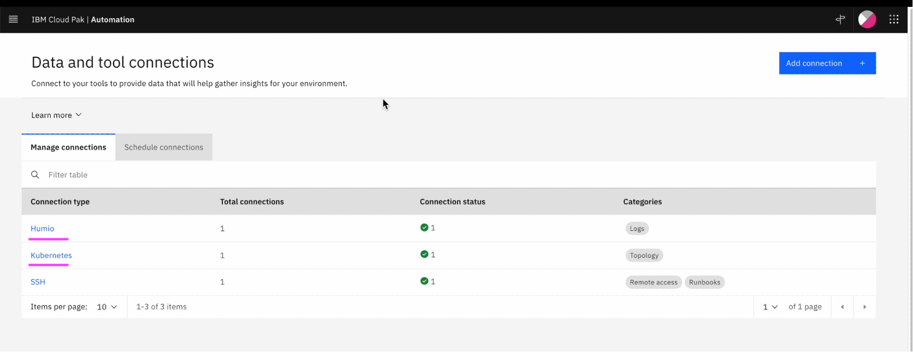
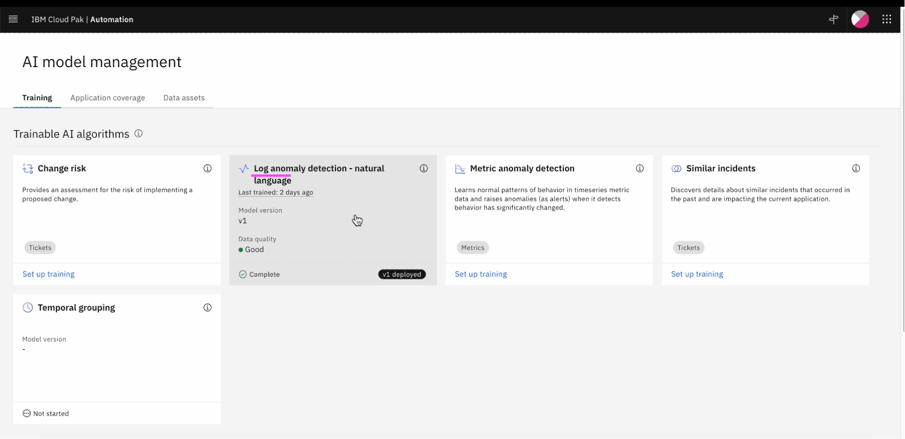
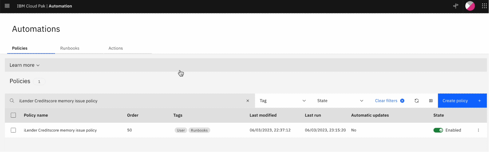
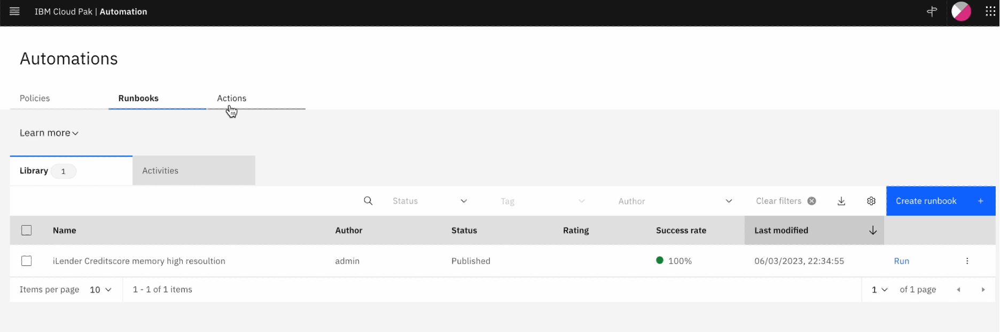
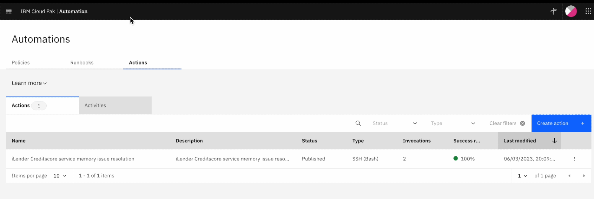
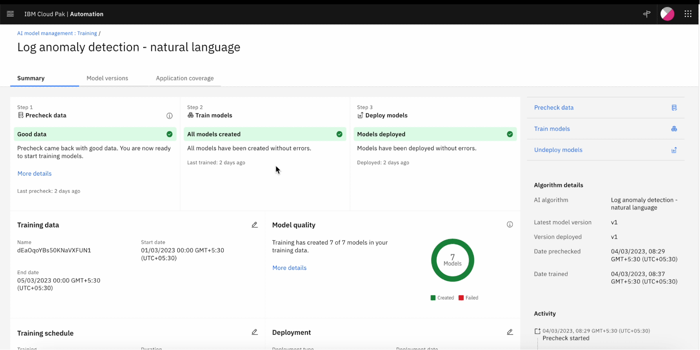
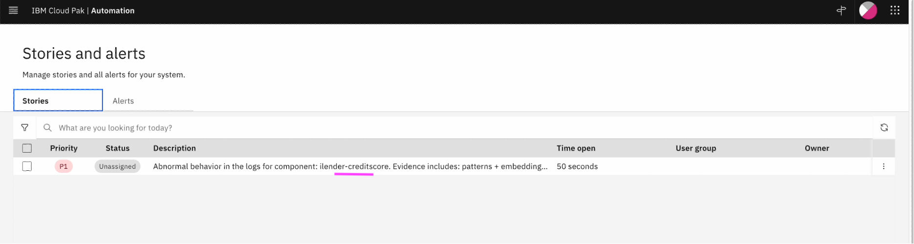
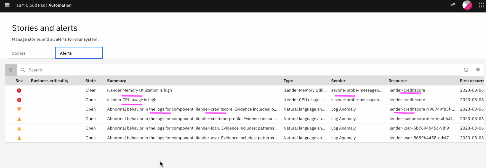

# Demo Setup - Proactive Incident Resolution with Watson AIOps and SevOne

This article explains about how to setup the `Proactive Incident Resolution with Watson AIOps and SevOne` demo which is explained in the [transcript](../01-demo-transcript)

The article is based on the following
 - RedHat OpenShift 4.10 on IBM Cloud (ROKS)
 - Watson AIOps 3.6.0

## Operational Architecture

Here is the Operational architecture that we are going to setup.

- OpenShift 4.10 Cluster is installed on IBM Cloud (ROKS)
- Watson AIOps AIManager is installed on this cluster.
- Humio logging system can be deployed on the same/another OCP cluster.
- iLender Application can be deployed on the same/another OCP cluster.
- SevOne is installed and available.
- SevOne Probe is installed on the same cluster where WAIOps AIManager is installed.

## 1. PreRequiste

#### 1.1 Watson AIOps 3.6.0 AIMgr

Watson AIOps 3.6.0 AIMgr is required for this Demo as a Pre-Requisite. If you want to install AIMgr on ROKS you can use this [Script](../41-install-aimgr-on-roks) to install.

#### 1.2 SevOne

SevOne should be installed and available.

## 2. Setup Tools for Integration

#### 2.1 Install Humio

Install Humio in the OCP Cluster where WAIOps AIMgr is installed.

Steps are available [here ...](./11-installing-humio-on-openshift)

#### 2.2 Configure SevOne

Install WAIOps SevOne Probe and Configure SevOne to forward events to the Probe.

Steps are available [here ...](../31-configuring-sevOne-events-to-aimanager)

## 3. Setup Managed Environment

#### 3.1 Install iLender app

Install iLender app on the managed environment. It could be on the same OCP cluster where AIManager is installed.

Steps are available [here ...](./12-application-installation)

## 4. Setup Data and Tool Configurations

Need to setup the below data and tools integrations.

#### 4.1 Setup Humio Integration

Setup Humio integration.

Steps are available [here ...](./30-integrations-humio)  (The steps are from WAIOps 3.3 version)

#### 4.2 Setup Kubernetes Integration

Setup Kubernetes integration.

Steps are available [here ...](./33-integrations-kubernetes-observer)  (The steps are from WAIOps 3.3 version)

## 5. Application Management

#### 5.1 Create Application

Create Application from Resource Groups

Steps are available [here ...](./40-application-management)  (The steps are from WAIOps 3.3 version)

## 6. AI Model Management

#### 6.1 Create Log Anomaly Detection Definition

Need to create Training Definition for Log Anomaly Detection as like below.

Steps are available [here ...](./50-ai-model-log-anomaly)  (The steps are from WAIOps 3.3 version)

#### 6.2 Runbook Automation

Need to create Runbook as like below.

Steps are available [here ...](./54-runbook)  (The steps are from WAIOps 3.3 version)

## 7. Training

#### 7.1 Generate Load

Generate the load for the iLender app for the training.

Steps are available [here ...](./21-application-load-generation)  (The steps are from WAIOps 3.3 version)

#### 7.2 Log Anomaly Detection training 

Create load in app, enable Data flow on humio integration, selection the mode, start the Log Anomaly Detection training.

The trained log model should be like this.

Steps are available [here ...](./61-training-log-anomaly)  (The steps are from WAIOps 3.3 version)

## 8. Inferencing

#### 8.1 Demo Script

Prepare demo script to introduce log anomaly and ingest events.

Steps are available [here ...](./70-inferencing-demo-script)  (The steps are from WAIOps 3.3 version)

#### 8.1 Run Demo

Run the demo script to induce error in credtiscore service based on the load

Steps are available [here ...](./71-inferencing-run-demo)  (The steps are from WAIOps 3.3 version)

#### 8.2 Check Stories on Web console

Check the stories created by Watson AIOps as like this.

The story and alerts should have been created like this.

