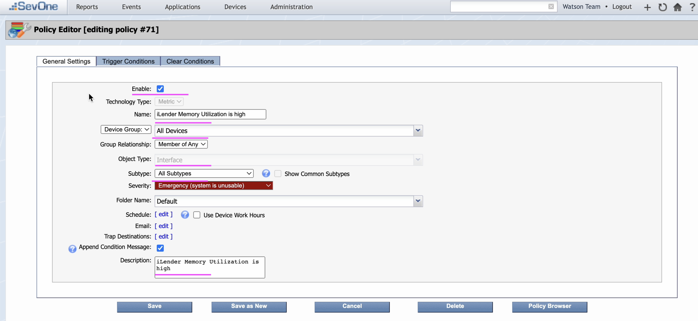

# SevOne Policy Creation

This document explains about how to create SevOne Policy to forward live events to WAIOps.

## 1. Policy : iLender memory Utilization is high

### 1.1. Create Policy

1. In SevOne Console, click on `Events > Configuration > Policy Browser` to open the Policy Browser.


2. The `policy browser` screen is displayed.


3. Choose `iLender memory Utilization is high` tab. (To create new policy need to click `Create Policy` menu but we go with edit flow)

### 1.2 General Settings

Enter the values as per screenshot. 



### 1.3 Trigger OnCondition 

1. Enter the value for `Trigger message`. 


2. Create`Condition A` with the values as below

**Note:** Since it is a demo, We are not really creating memory related policy Indicator here.


3. Create`Condition B` with the values as below

**Note:** Since it is a demo, We are not really creating memory related policy Indicator here.


4. Create`Condition Rules` both `1` and `2`

5. For `Method` choose `POST`

6. For `Webhook Destinations`, move the created webhook (SevOne Probe for WAIOps) to the right side.

5. For `BODY` copy the content from the below. It is tailored for this demo.
```
{
"routes": [ "Netcool" ],
"host" : "ilender-creditscore",
"description": "iLender Memory Utilization is high",
"alertMessage": "iLender Memory Utilization is high",
"check": "$policyName",
"cluster": "$groupName",
"alertId": "$alertId",
"alertType": "$alertType",
"alertState": "$alertState",
"occurrences": "$occurrences",
"assignedTo": "$assignedTo",
"deviceId": "$deviceId",
"deviceIp": "11.22.33.44",
"deviceName": "ilender-creditscore",
"deviceAltName": "ilender-creditscore",
"groupName": "$groupName",
"objectId": "$objectId",
"objectName": "ilender-creditscore",
"objectAltName": "ilender-creditscore",
"objectDescription": "iLender Memory Utilization is High",
"pluginName": "$pluginName",
"pluginDescription": "$pluginDescription",
"policyId": "$policyId",
"policyName": "$policyName",
"thresholdId": "$thresholdId",
"thresholdName": "$thresholdName",
"triggeringConditions": $triggeringConditions
}
```

Actually content as per [IBM Doc](https://www.ibm.com/docs/en/cloud-paks/cloud-pak-watson-aiops/3.6.2?topic=integration-probe-sevone-npm-ai-manager) is in Step 7 (Trigger conditions).


### 1.4 Trigger ClearCondition 

1. Enter the value for `Clear message`. 


2. Create`Condition A` with the values as below.

**Note:** Since it is a demo, We are not really creating memory related policy Indicator here.


3. Create`Condition B` with the values as below

**Note:** Since it is a demo, We are not really creating memory related policy Indicator here.


4. Create`Condition Rules` both `1` and `2`

5. For `Method` choose `POST`

6. For `Webhook Destinations`, move the created webhook (SevOne Probe for WAIOps) to the right side.

5. For `BODY` copy the content from the below. It is tailored for this demo.
```
{
"routes": [ "Netcool" ],
"host" : "ilender-creditscore",
"description": "iLender Memory Utilization is high",
"alertMessage": "iLender Memory Utilization is high",
"check": "$policyName",
"cluster": "$groupName",
"alertId": "$alertId",
"alertType": "$alertType",
"alertState": "Cleared",
"occurrences": "$occurrences",
"assignedTo": "$assignedTo",
"deviceId": "$deviceId",
"deviceIp": "11.22.33.44",
"deviceName": "ilender-creditscore",
"deviceAltName": "ilender-creditscore",
"groupName": "$groupName",
"objectId": "$objectId",
"objectName": "ilender-creditscore",
"objectAltName": "ilender-creditscore",
"objectDescription": "iLender Memory Utilization is High",
"pluginName": "$pluginName",
"pluginDescription": "$pluginDescription",
"policyId": "$policyId",
"policyName": "$policyName",
"thresholdId": "$thresholdId",
"thresholdName": "$thresholdName"
}

```

Actually content as per [IBM Doc](https://www.ibm.com/docs/en/cloud-paks/cloud-pak-watson-aiops/3.6.2?topic=integration-probe-sevone-npm-ai-manager) is in Step 7 (Clear conditions).


### 1.5 Save the Policy

Save the policy by selecting `Save` button.


## 2. Policy : iLender CPU usage is high

### 2.1 Create Policy

From the `policy browser` screen Choose `iLender CPU usage is high` tab. (To create new policy need to click `Create Policy` menu but we go with edit flow)


### 2.2 General Settings

Enter the values as per screenshot. 


### 2.3 Trigger OnCondition 

1. Enter the value for `Trigger message`. 


2. Create`Condition A` with the values as below

**Note:** Since it is a demo, We are not really creating cpu related policy Indicator here.


3. Create`Condition B` with the values as below

**Note:** Since it is a demo, We are not really creating cpu related policy Indicator here.


4. Create`Condition Rules` both `1` and `2`

5. For `Method` choose `POST`

6. For `Webhook Destinations`, move the created webhook (SevOne Probe for WAIOps) to the right side.

7. For `BODY` copy the content from the below. It is tailored for this demo.
```
{
"routes": [ "Netcool" ],
"host" : "ilender-creditscore",
"description": "iLender CPU usage is high",
"alertMessage": "iLender CPU usage is high",
"check": "$policyName",
"cluster": "$groupName",
"alertId": "$alertId",
"alertType": "$alertType",
"alertState": "$alertState",
"occurrences": "$occurrences",
"assignedTo": "$assignedTo",
"deviceId": "$deviceId",
"deviceIp": "11.22.33.44",
"deviceName": "ilender-creditscore",
"deviceAltName": "ilender-creditscore",
"groupName": "$groupName",
"objectId": "$objectId",
"objectName": "ilender-creditscore",
"objectAltName": "ilender-creditscore",
"objectDescription": "iLender CPU usage is high",
"pluginName": "$pluginName",
"pluginDescription": "$pluginDescription",
"policyId": "$policyId",
"policyName": "$policyName",
"thresholdId": "$thresholdId",
"thresholdName": "$thresholdName",
"triggeringConditions": $triggeringConditions
}

```

Actually content as per [IBM Doc](https://www.ibm.com/docs/en/cloud-paks/cloud-pak-watson-aiops/3.6.2?topic=integration-probe-sevone-npm-ai-manager) is in Step 7 (Trigger conditions).


### 2.4 Trigger ClearCondition 

1. Enter the value for `Clear message`. 


2. Create`Condition A` with the values as below

**Note:** Since it is a demo, We are not really creating cpu related policy Indicator here.


3. Create`Condition B` with the values as below

**Note:** Since it is a demo, We are not really creating cpu related policy Indicator here.


4. Create`Condition Rules` both `1` and `2`

5. For `Method` choose `POST`

6. For `Webhook Destinations`, move the created webhook (SevOne Probe for WAIOps) to the right side.

7. For `BODY` copy the content from the below. It is tailored for this demo.
```
{
"routes": [ "Netcool" ],
"host" : "ilender-creditscore",
"description": "iLender CPU usage is high",
"alertMessage": "iLender CPU usage is high",
"check": "$policyName",
"cluster": "$groupName",
"alertId": "$alertId",
"alertType": "$alertType",
"alertState": "Cleared",
"occurrences": "$occurrences",
"assignedTo": "$assignedTo",
"deviceId": "$deviceId",
"deviceIp": "11.22.33.44",
"deviceName": "ilender-creditscore",
"deviceAltName": "ilender-creditscore",
"groupName": "$groupName",
"objectId": "$objectId",
"objectName": "ilender-creditscore",
"objectAltName": "ilender-creditscore",
"objectDescription": "iLender CPU usage is high",
"pluginName": "$pluginName",
"pluginDescription": "$pluginDescription",
"policyId": "$policyId",
"policyName": "$policyName",
"thresholdId": "$thresholdId",
"thresholdName": "$thresholdName"
}
```

Actually content as per [IBM Doc](https://www.ibm.com/docs/en/cloud-paks/cloud-pak-watson-aiops/3.6.2?topic=integration-probe-sevone-npm-ai-manager) is in Step 7 (Clear conditions).

### 2.5 Save the Policy

Save the policy by selecting `Save` button.
