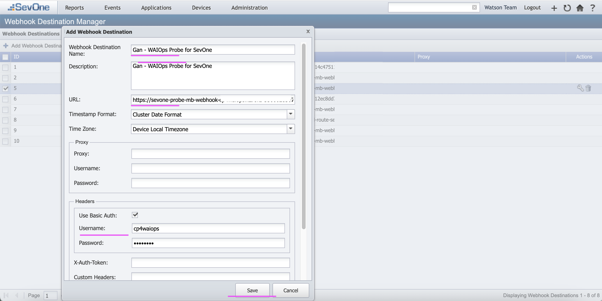

# SevOne Webhook Creation

This document explains about how to create Webhook in SevOne to forward live events to WAIOps SevOne Probe Webhook.

## Steps

1. Login into SevOne Console

2. Click on `Events > Configuration > Policy Browser` to open the Policy Browser.

3. Click on `Configure Webhook Destination`.

4. Click on `Add Webhook Destination`.

5. Enter the below values

- Name  : Gan - WAIOps Probe for SevOne
- Description :  Gan - WAIOps Probe for SevOne
- URL :  Refer the PROBE_WEBHOOK_URL value printed during the SevOne Probe installation [../21-install-sevone-probe-aimgr](../21-install-sevone-probe-aimgr)
- Use Basic Auth : Check it
- Username :  Refer the value of the property `SEVONE_USER` from SevOne Probe installation config file [00-config.sh](../21-install-sevone-probe-aimgr/files/00-config.sh)
- Password :  Refer the value of the property `SEVONE_PASSWORD` from the above config file.

6. The webhook is saved.

